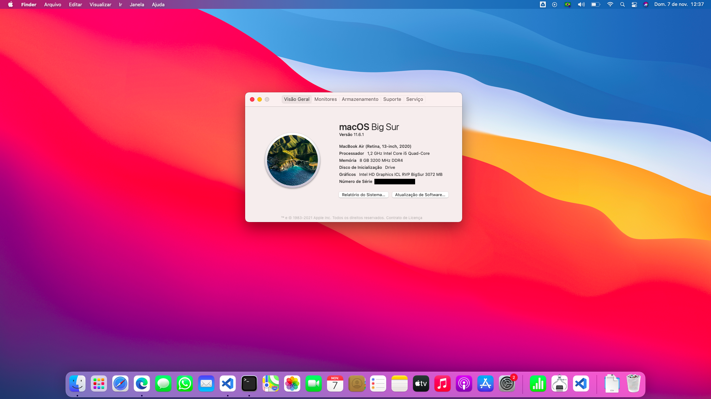

# Lenovo Ideapad 5 14IIL05 with Ventura (13.0.1)

Laptop Specs:

- Intel Ice Lake 10th 1035G1
- Intel Wireless Killer
- Realtek ALC257

This is my EFI folder compatbile with MacOS 13.0.1 (Ventura)

- Big Sur 13.0.1þ
- Almost everything work.

## Bugs:

- Hotkeys for backlight control dont work yet
- Bluetooth (maybe [IntelBluetoothFirmware] will compatible, i haven't tested it yet)

## OBS

- Before using this EFI, dont forget to set your own PlatformInfo like serial number in config.plist (check dortania guide)
- If you know solutions for these bugs please open an issue or send me a message!

[applealc]: https://github.com/acidanthera/AppleALC
[intelbluetoothfirmware]: https://github.com/OpenIntelWireless/IntelBluetoothFirmware
