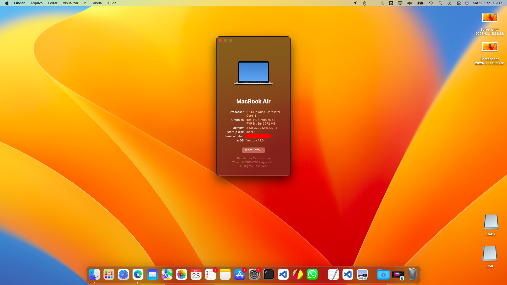

# Lenovo Ideapad 5 14IIL05 with Big Sur

Laptop Specs:

- Intel Ice Lake 10th 1035G1
- Intel Wireless Killer
- Realtek ALC257

This is my EFI folder compatbile with MacOS 11.6.1 (Big Sur)

- Big Sur 11.6.1
- Almost everything work.

## Bugs:

- Hotkeys for backlight control dont work yet
- After turning on the macos, the backlight will be set to down (it will look like the computer turned off, but dont worrie), to fix close the computer lid, wait some seconds and open again, the backlight will be back
- Bluetooth (maybe [IntelBluetoothFirmware] will compatible, i haven't tested it yet)
- Microphone :(I tested all layouts ID from [AppleALC], but no luck)

## OBS

- Before using this EFI, dont forget to set your own PlatformInfo like serial number in config.plist (check dortania guide)
- If you know solutions for these bugs please open an issue or send me a message!

[applealc]: https://github.com/acidanthera/AppleALC
[intelbluetoothfirmware]: https://github.com/OpenIntelWireless/IntelBluetoothFirmware
